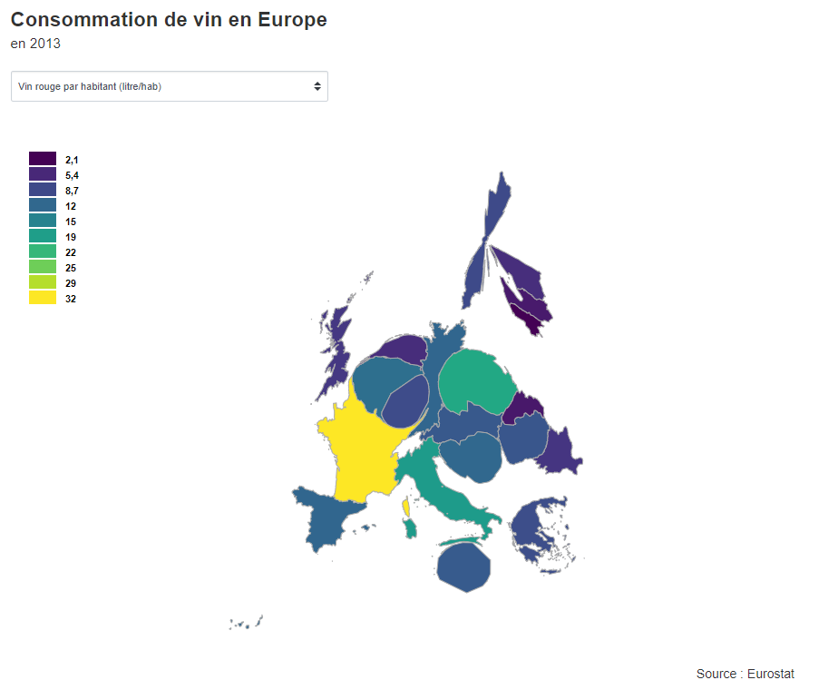

# Cartogramme de la consommation de vin en Europe

Un exemple de cartogramme réalisé avec le package [`topogram`](https://github.com/dreamRs/topogram) et des données d'[`eurostat`](https://github.com/rOpenGov/eurostat).

Le document est accessible ici : https://pvictor.github.io/cartogramme-vin/

Voici un aperçu :

